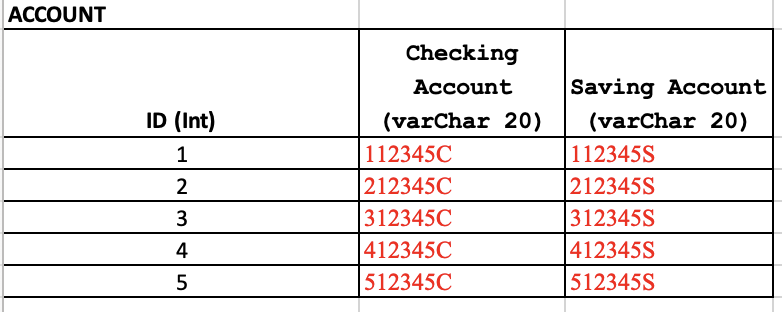
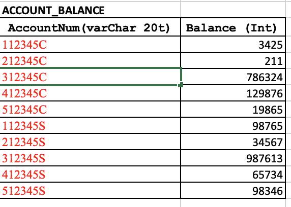

# **Assignment No. 1 - Logging and Rollback**

# **Description**
You are going to simulate a logging and rollback system for a simple database that encompasses individuals, their bank accounts and the balances of those accounts.

As we are focusing on the conceptual side, we will not be using MariaDB or any other RDBMS. After all, the latter include in their design this logging and rollback capabilities.

To simplify the problem, we will focus on the accounts of Emma Frost, BankID = 3.

Below you'll find an image of the CUSTOMER DB:

# **Transaction to be executed**
Emma will be moving $100,000 from her checking account (312345C) to her Savings Account (312345S).

**BEFORE Transaction**

Checking Balance = 786324

Savings Balance = 987613

**AFTER Transaction**

Checking Balance = 686324

Savings Balance = 1087613

It is important to understand that Emma's transaction is only ONE: transferring $100,000 from her Checking Account to her Savings Account. This is one logical transaction.

However, this transaction is divided into two distinct  operations:
1. Updating Emma's balance for her Checking Account (subtracting the amount to be transferred out)
2. Updating Emma's balance for her Savings Account (adding to the savings' balance the incoming money transfer)

For your simulation, Emma's transaction is satisfactorily completed ONLY when both operations -1 and 2 above, are completed!

# **Simulation Requirements**
- Understanding whether your logging & rollback system is successful, will depend on 2 aspects:
   1. The contents of your logging & rollback data structure
   2. The status of the values for Checking & Savings of the balances relation (table)

Below the schemas for the ACCOUNT and ACCOUNT_BALANCE Relations (Tables):

- COMMIT: as we know, a COMMIT is the signal we send to the RDBMS, telling it that a logical-transaction has been executed successfully. Hence, it is time to make the changes we've performed to the Database, persistent (save them to secondary storage).

- In our simulation, Main_Memory corresponds to the data structure you are manipulating in your code (Main-Memory) to make a given transaction happen.

- In our simulation, SECONDARY_MEMORY -the place where the data will be persisted- will be a file in your computer (you can assume that the structure of the file is a .csv file). The .csv files for your assignment will be provided to you, and they correspond to the Relations' images shown above.

- A successful transaction will show two things:
   1. Your .csv files (your Tables) should show the expected values after a successful transaction.
   2. Your Logging & Rollback Data Structure should show all transactions as completed -or should be EMPTY.

- An un-successful transaction will show two things:
   1. Your .csv files (your Tables) should show the updated values (if an operation managed to get executed)
   2. Your Logging & Rollback Data Structure should show what transaction(s) would need to be reversed (roll-back).

**Bonus Task (3 extra points)**

With regard to fixing database inconsistencies that may have been introduced because of an unsuccessful logic transaction where the first operation (withdrawal) was completed, but not the second one (adding the money to savings), you could chose to:
- show the database "as is" -the tables/relations-, AND
- present your Logging-Rollback system with the right values for the incomplete operation to be reverted.

If instead, you decide to:
- "automatically" restore the database to a "healthy state" using your Rollback System, AND
- show your Logging-Rollback system status, too,

then you will be given 5 additional points for your work.

You should print out the contents of your Logging & Rollback System as soon as an EXCEPTION is detected. If you prefer, you could make your data structure persistent by writing it to a file (this file MUST be different than the files that contain the Database Tables/Relations). The recommendation would be to use one file (.csv) per relation/table.

# **Proposed Architecture**
The architecture for this "simulation" is as follows:

As you examine the diagram above, please consider the following:

- The .csv files representing the Database Tables should be read to main memory and manipulated there using a data structure appropriate for the job at hand (array, list, etc.)
- Once a COMMIT is issued, the data structure -representing the Tables- in Main Memory, is persisted to disk, in .csv format
- Your Log Sub-system, for which you must define its attributes and structure, will be in Main Memory and could be persisted to Disk, whenever you'd like, and using the format of your choice. You may want to think about this design aspect.
- The starting program provided will give you more insight into how tasks are supposed to be executed

# **Starting Code for Main Program (in Python)**
A starting code written in Python is included in GitHub. There are **two Transaction Blocks**. The first one is supposed to succeed, and the secod one to fail! Hence, if an exception would occur BEFORE you have managed to issue a COMMIT, your Database would most likely be in bad shape, and your Logging & Rollback Data Structure would be your only hope to restore your database to the proper level of integrity and stability.

# **Designing the Logging & Rollback Sub-system**
The design of the data structure -and its contents- for the Logging & Rollback sub-system is in your hands. You can choose any data structure that works for you. Having said that, the material covered in class -as well as the Class' Notes- should provide all the advice you need to design your solution.

# **Output and Documentation**
- Output: your output should show the status of the DB Tables before and after every Transaction Block (see starting code). In addition, the status of your Log Sub-system should be presented, too
- Documentation: in-line comments are accepted. Design decisions and data structures and processes descriptions, must be included in your report. Samples of your outputs, as described in the previous bullet point, should be included in your report.

# **Programming Language of Choice**
Please select your language among those listed below:
   - Python
   - Java
   - C/C++

# **Submitting your work / Due Date**
Due Date: **14/Feb/2023 at 11:59PM**

You could post your work three different ways:
- Using this GitHub Repo (kindly post your code to the folder "YourCode". This is the **preferred option**), or
- Using the D2L option available to all students, or
- Using both, the GitHub Repo and D2L

Note: only **one** member of the team needs to post the work. Make sure all the names of the members of each team are clearly referenced in your submission.
